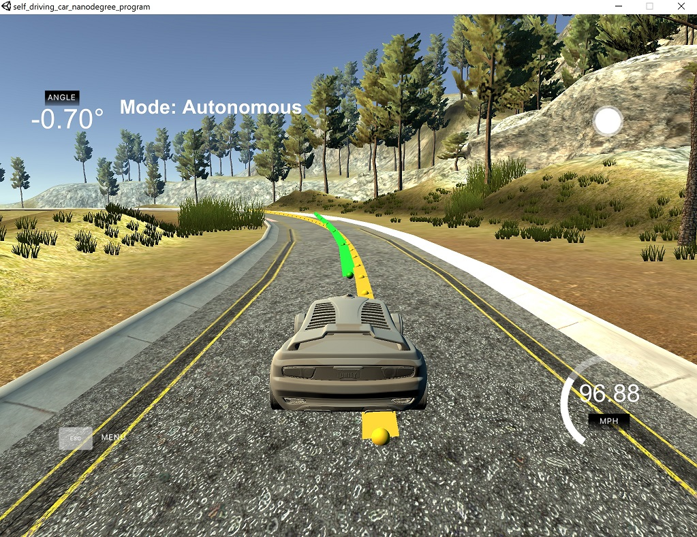

# CarND-Controls-MPC
Self-Driving Car Engineer Nanodegree Program

## Description

This repository contains my implementation of the Model Prective Control (MPC) project of the Self-Driving Car Engineer Nanodegree Program in C++.

The program takes input from a the Udacity car simulator (2D car position, heading, velocity, cross-track error and heading error) and computes and feeds the control values (steering angle and acceleration) back.

## Steps
1. As the input waypoints which mark the middle of the road are in world coordinates we first convert them to the car's coordinate system. This greatly simplifies the calculations.
2. Fit an at least order 3 polynomial on the waypoints (actually, as stated in http://www2.informatik.uni-freiburg.de/~lau/students/Sprunk2008.pdf, an even higher degree (quintic) might be necessary to get optimal results)
```c++
auto coeffs = polyfit(waypoints_x_eig, waypoints_y_eig, 3);
```
3. Calculate the cross-track error and the heading error using the polynomial. The cross-track error is the value of the polynomial at 0, and the error of the orientation is the arctan of the 2nd order coefficient. (The `epsi` value has to be negated because the simulator flips sides)
```c++
double cte = polyeval(coeffs, 0);  
double epsi = -atan(coeffs[1]);  
```
4. The state vector is fed to the MPC Solver function which calculates the control parameters using a model-based cost function and with respect to the control variable constraints. The most important factor here is the cost function because it is responsible for the jerk-free and smooth control of the car's motion through the weighted sum of the following terms:
```c++
    // The part of the cost based on the reference state.
    for (unsigned int t = 0; t < N; t++) {
      fg[0] += c_cte    * CppAD::pow(vars[cte_start + t], 2);
      fg[0] += c_epsi   * CppAD::pow(vars[epsi_start + t], 2);
      fg[0] += c_v      * CppAD::pow(vars[v_start + t] - ref_v, 2);
    }
    // Minimize the use of actuators.
    for (unsigned int t = 0; t < N - 1; t++) {
      fg[0] += c_delta  * CppAD::pow(vars[delta_start + t], 2);
      fg[0] += c_a      * CppAD::pow(vars[a_start + t], 2);
      fg[0] += c_vd     * CppAD::pow(vars[delta_start + t] * vars[v_start+t], 2);
    }
    // Minimize the value gap between sequential actuations.
    for (unsigned int t = 0; t < N - 2; t++) {
      fg[0] += c_ddelta * CppAD::pow(vars[delta_start + t + 1] - vars[delta_start + t], 2);
      fg[0] += c_da     * CppAD::pow(vars[a_start + t + 1] - vars[a_start + t], 2);
    }
```
The parameters `c_cte`, `c_epsi`, `c_v`, `c_delta`, `c_a`, `c_vd`, `c_ddelta` and `c_da` are the relative weights to scale each error term appropriately in the final cost sum. Terms with higher weights will have major, terms with lower weights will have minor influence on the car's behaviour. One of the above terms, `steering angle` * `velocity`, was not used in the class materials, I got a hint from a fellow student (Ernesto Cullen) that it might help reducing the wobbles - and, in fact, it helped a lot. The weight coefficients then were tuned manually. 

5. The output of the solver contains the control parameters (steering angle and throttle) and the calculated waypoints (for displaying them in the simulator - the reference trajectory is yellow, the calculated is green). 



# Other parameters

As reference speed, I set 100mph (I started with 40 then tried 80, finally I settled with 100). In fact, my car never reaches the target speed as the weight for the target speed is relatively low and there are no long straight sections but 97 is reachable close to the starting point (after the second lap, of course).

The number of the calculated points (N) and the timestep delay are two factors that greatly determines the controller's accuracy and stability. I played a lot with these values and I found that below 0.1s it is not really worth it as the controller delay is 100ms anyway. Slowing it down (to 0.2s or below), however, made the car wobble a lot, especially at high speeds. Increasing N increases the number of variables and through this, the computational cost. As we calculate the points after each step, however, I tried to reduce it as much as possible (although on my high-end machine the computational cost was negligable, on slower, embedded systems it might be a good idea to spare as many resources as possible). So I ended up calculating only 8 points. Below that, the controller became instable (especially in the strongest curves) but 8 seems to be enough.

# Conclusions

This is the third controller which we had to design for this project and this is the most sophisticated of them. For the first time I was able to drive the car with 100mph easily without any sudden jerks or faults. The mathematics behind this controller are not easy at all but the results are quite impressive. I will definitely try this in my own robot project, too.

---
## Basic Build Instructions

1. Clone this repo.
2. Make a build directory: `mkdir build && cd build`
3. Compile: `cmake .. && make`
4. Run it: `./mpc`.

